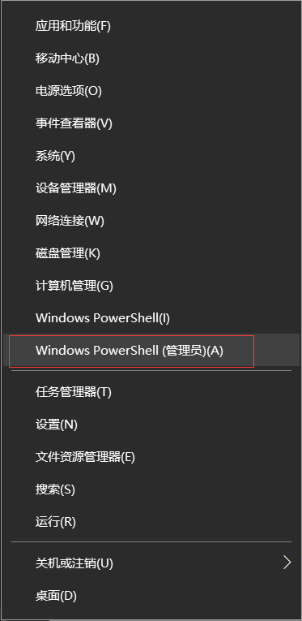

## [Win10 常见问题解决方案](#title)

&emsp;&emsp;💡 首先，为什么要写这份文档？ 1. Windows 操作系统问题实在是多；2. Windows 用户实在是多；3. 电脑出了问题找程序员朋友的人实在是多。 &emsp;&emsp;所以为了方便统一，仅此记录一些常见问题解决方案写成文档，以供大家参考，也以便减少我每次网上帮你们查阅所浪费的时间成本。

### ⭐ 目录查询

>> **特别提醒：** 如果以下方法并没有帮助到您，请联系作者QQ 784958034。或者您有什么新的问题也可与我进行联系。

+ [“你的电脑将在一分钟后自动重启”](#Q1) 解决方法 [➡](#Q1)

+ [“电源已接通，未充电”](#Q2) 解决方法 [➡](#Q2)

---

    

### 具体症状表现：

&emsp;&emsp;无限提示以下消息：[“你的电脑将在一分钟后自动重启，Windows 遇到问题需要重新启动。你应立刻关闭此消息并保存你的工作。”](#message) &emsp;&emsp;之后会无限重启，电脑变得异常卡慢。

    

### 原因及解决方法：

&emsp;&emsp;**[第一步：在下图所示启动界面按住 `shift` 键点击重启。](#first)**

    

&emsp;&emsp;**[第二步：依次选择 “查看高级修复选项” → “疑难解答” → “高级选择” → “启动设置” → “重启”。](#second)**

&emsp;&emsp;**[第三步：在重启时狂按 `F4` 键，进入安全模式。](#third)**

&emsp;&emsp;**[第四步：键盘快捷键 `Win + X`（鼠标操作为 `右击电脑屏幕左下角 Windows 图标`）。选择 Windows PowerShell(管理员)(A)，如下图红色框标出。](#forth)**

    

&emsp;&emsp;**[第五步：在命令行中输入 `netsh winsock reset`，按下回车执行，然后重启电脑，完成。](#fifth)**

    

    <a href="#-目录查询">返回目录 ⬆</a>

---

    

### 原因及解决方法：

&emsp;&emsp;**[第一，有可能是系统或者是软件设置问题。](#first)** &emsp;&emsp;通常来说，很多电脑品牌如戴尔、联想、索尼等，均会为自家笔记本配备电源管理软件。如果启用了某种“电池保护模式”，电源管理软件在侦测到用户使用交流电源后会禁止电池充放电，以此来延长电池使用寿命。所以，如果你发现自己的笔记本不充电，可以先进入相关的电源管理软件中，**关闭电池保护模式** 或是 **勾掉禁止充电选项**。

&emsp;&emsp;**[⭐第二，有较大可能是主板充放电电路问题。](#second)** &emsp;&emsp;解决方法暴力有效，（可以在连接电源下进行）**强制按住开关机按钮键不要松开直至电脑完全关机**，**关机后再次按住开关机按钮键 30 秒不松开**（中间电脑会出现一次开机闪屏然后又会立马重新关机），**最后按下一次开关机按钮键进行开机**，开机后就 ok 了。当然，开机后可能还是显示“未充电”，这种情况下稍微等一下就好了。如果要解释原理，可以理解为：释放主板静电。

&emsp;&emsp;**[第三，有可能是电源接触问题。](#third)** &emsp;&emsp;在第二条失效的情况下，我们只能采用物理办法来解决了。但是这个方法也有一定问题，即只针对自助拆卸电池的笔记本电脑。方法就是 **重新插拔电池**，这个也最好请专业的同学或师傅来处理。

&emsp;&emsp;**[第四，有可能是电池自身的硬件故障。](#forth)** &emsp;&emsp;这种问题比较麻烦，也是大家最不愿意遇见的。不过我们可以安装一些硬件检测应用，看看电池是否损耗过大。如果是电源硬件损坏还是要选择专业维修店去进行 **修理** 或 **换用**。

    <a href="#-目录查询">返回目录 ⬆</a>

